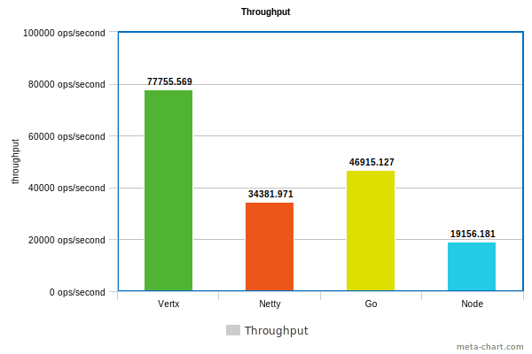
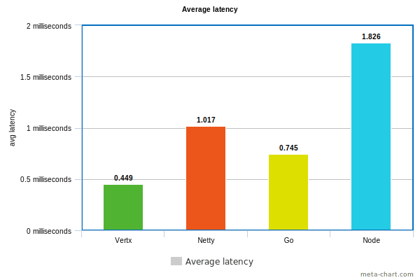
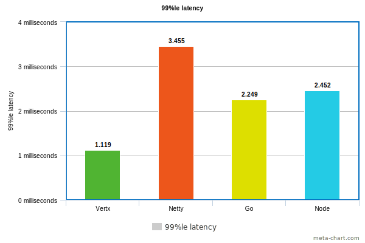

## Server benchmark

This project benchmarks few popular Http servers with no/very minimal configurations apart from the default ones.

#### Servers benchmarked

- [Vertx](https://vertx.io/)
- [Netty](https://netty.io/wiki/user-guide-for-4.x.html)
- [Go](https://golang.org/doc/articles/wiki/#tmp_4)
- [NodeJS](https://nodejs.org/api/http.html)

#### Results

| Server | Failed requests | Throughput (req/sec) | Avg latency (millis) | Min latency (millis) | Max latency (millis) | 99% latency (millis) |
| ------ | --------------- | -------------------- | -------------------- | -------------------- | -------------------- | -------------------- |
| Vertx  | 0               | 77755.569            | 0.449                | 0.060                | 94.862               | 1.119                |
| Netty  | 0               | 34381.971            | 1.017                | 0.078                | 202.360              | 3.455                |
| Go     | 0               | 46915.127            | 0.745                | 0.036                | 38.939               | 2.249                |
| Node   | 0               | 19156.181            | 1.826                | 0.267                | 6.040                | 2.452                |

**Throughput**
_Higher is better_


**Latencies**
_Lower is better_




#### Test Settings

**Hardware/OS MacOS** Sierra 10.12.6 2.5 GHz Intel Core i7 16 GB 2133 MHz LPDDR3

**JVM** java version "1.8.0_181" Java(TM) SE Runtime Environment (build 1.8.0_181-b13) Java HotSpot(TM) 64-Bit Server VM (build 25.181-b13, mixed mode)

**Go** go version go1.11.2 darwin/amd64

**Node** v8.11.1

**Benchmark tool** [apib](https://github.com/apigee/apib)

**Input & Output**

The serve echoes the path params.

Input: 
```http
GET http://localhost:{port}/HelloWorld
```

Output:
```http
/HelloWorld
```

#### Conclusion

With this setting and the input, Vertx performed the best - thanks to the combination of event loops and JVM. Go is the second best. NodeJS performed the worst in the bunch.